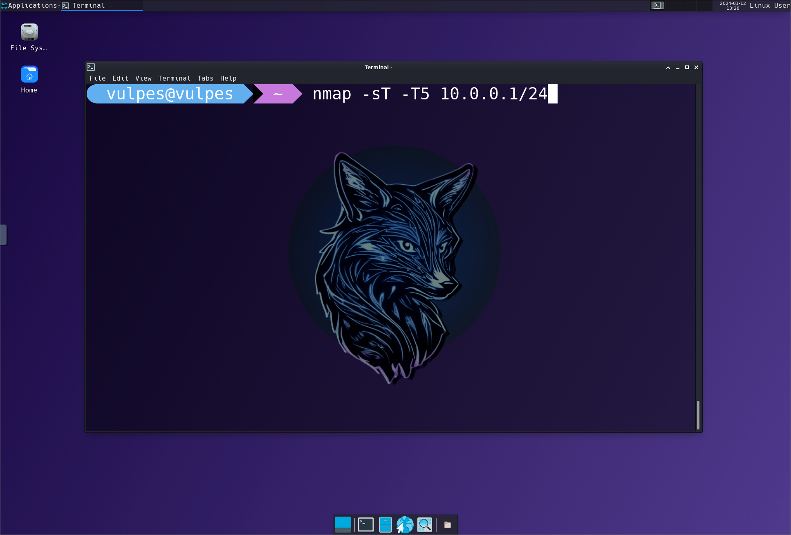

# Vulpes / VulpOS 🦊

All-in-one Docker-based workstation with hacking tools for Pentesting and offsec Labs, maintained by [@Fenrir.pro](https://github.com/fenrirsec).


Based on **Alpine Linux**, Vulpes is clutter-free, lightweight, and perfect for penetration testing, local training, workshops, and online classes on [hack.courses](https://hack.courses).

## Why? 🤔

We needed an efficient, hacking-oriented OS with a minimal CPU/RAM/storage footprint for on-demand online workstations. Unlike bulky systems like Kali and Ubuntu that take 20~30 minutes to set up, Vulpes deploys in under 20 seconds on Windows!

So, here's Vulpes (or VulpOS, still deciding on the name)!

## Quick Setup ⚡

### On Windows?

```powershell
PS> docker-compose -f docker-compose-win-novnc.yml up
```

### On a UNIX-like system?

```bash
$> docker-compose -f docker-compose-unix-novnc.yml up
```

Once built (usually in 10 to 20 seconds), access Vulpes in your browser:

- **Locally**: http://127.0.0.1:8080/?path=127.0.0.1:6080
- **On a server/remote machine**: http://YOUR_SERVER_IP:8080/?path=YOUR_SERVER_IP:6080

> **IMPORTANT**: The default configuration exposes ports 8000 (noVNC web interface), 6080 (websockify), and 5900 (VNC) on 0.0.0.0. Ensure you trust machines on your local network and change the default VNC password (currently *CHANGEME*) in the *docker-compose-win-novnc.yml* file.

## Screenshots 📸



## Current Goals 🎯

- Keep the distribution lightweight, ensuring it builds in under a minute with a standard network connection.
- Integrate all tools needed for our training sessions.

## Default Toolset 🛠️

- Wireshark
- nmap
- radare2
- netcat
- socat
- John the Ripper

## Additional Installable tools

- Metasploit Framework
- CrackMapExec

Dive in and hack away! 🚀
