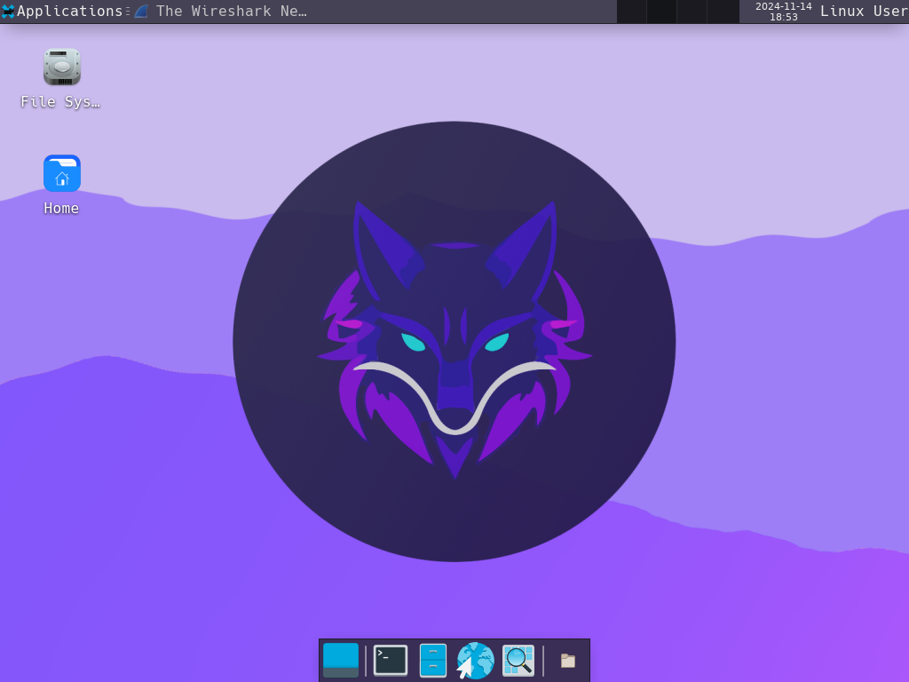

# Vulpes / VulpOS

All in one Docker-based workstation with hacking tools for Pentesting and offsec Labs by maintained by [@Fenrir.pro](https://github.com/fenrirsec).

It is based on **Alpine Linux**, clutter-free, lightweight and actively used for penetration testing assessments, local training sessions, workshops and online classes on [hack.courses](https://hack.courses).

## Why?

We deploy on-demain online workstations and needed a hacking-oriented operating system with a small CPU/RAM/storage footprint (smaller than kali and ubuntu at least which took sometimes 20~30 minutes to setup). 

Also, being able to deploy a new Linux hacking machine on a Windows workstation in less than 20 seconds is definitely enjoyable.

So here's Vulpes (also VulpOS, still unsure about the name)!

## Quick Setup

### You're on Windows?

`PS> docker-compose -f docker-compose-win-novnc.yml up`

### You're on a UNIX-like system?

`$> docker-compose -f docker-compose-unix-novnc.yml up`

Once your build is done (which takes usually around 10 to 20 seconds) you can enjoy Vulpes in your browser on : http://127.0.0.1:8080/?path=127.0.0.1:6080

> **IMPORTANT** : This default docker-compose configuration exposes three ports on your machine's 0.0.0.0 : 8000 (noVNC web interface), 6080 (websockify) and 5900 (VNC). Make sure you trust machines on your local network if you keep this default configuration and change the default VNC password that is *CHANGEME* in the *docker-compose-win-novnc.yml* file. I repeat : those three services are exposed on your machine's network interfaces by default!

## Screenshots

## Current Goals

- Keep the distribution lightweight, make sure it builds in less than a minute with a regular network connection
- Integrate every tool we might need to use for our training sessions

## Default Toolset

- Wireshark
- nmap
- radare2
- netcat
- socat
- john the ripper

